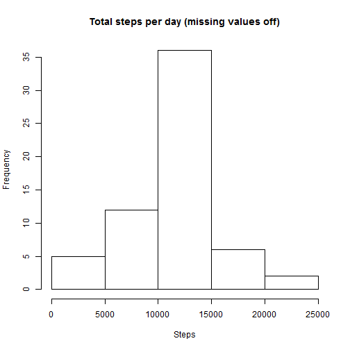
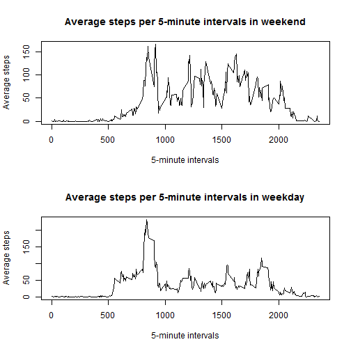

# Reproducible Research: Peer Assessment 1


## Loading and preprocessing the data

```r
activity <- read.table("activity.csv", header = TRUE, sep = ",")
```

## What is mean total number of steps taken per day?
### Histogram of the Total number of steps per day:

```r
hist(tapply(activity$steps, activity$date, sum, na.rm = TRUE), main = "Total steps per day", 
    xlab = "Steps")
```

 

```r
mdn <- median(tapply(activity$steps, activity$date, sum, na.rm = TRUE))
mn <- mean(tapply(activity$steps, activity$date, sum, na.rm = TRUE))
```

### Mean per day: 9354.2295
### Median per day: 10395

## What is the average daily activity pattern?
### Plot of the  5-minute interval / Average number of steps(across all days):

```r
ave_steps <- aggregate(steps ~ interval, data = activity, mean)
plot(ave_steps$interval, ave_steps$steps, type = "l", xlab = "5-minute intervals", 
    ylab = "Average steps", main = "Average steps per 5-minute intervals")
```

 

```r

max_interval <- ave_steps$interval[which.max(ave_steps$steps)]
average_steps_max <- ave_steps$steps[which.max(ave_steps$steps)]
```

### 5-minute interval with maximun number of steps on average: 835
### Maximun number of steps on average: 206.1698
## Imputing missing values

```r
miss <- sum(is.na(activity$steps))
```

### Total number of missing values in datasets is : 2304
### The strategy for filling in all of the missing values in the dataset consist in to use the mean for that 5-minute interval.

```r
activity <- merge(activity, ave_steps, by = "interval", suffixes = c("", "_meanxinterval"))
activity[is.na(activity$steps), 2] <- activity[is.na(activity$steps), 4]

hist(tapply(activity$steps, activity$date, sum, na.rm = TRUE), main = "Total steps per day (missing values off)", 
    xlab = "Steps")
```

 

```r
mdn <- median(tapply(activity$steps, activity$date, sum, na.rm = TRUE))
mn <- mean(tapply(activity$steps, activity$date, sum, na.rm = TRUE))
```

### Mean per day: 1.0766 &times; 10<sup>4</sup>
### Median per day: 1.0766 &times; 10<sup>4</sup>

### These values differ from the estimates from the first part of the assignment, the mean and median are the same. Additionally the histogram is more symmetric around de mean/median. The impact of imputing missing data on the estimates of the total daily number of steps is high.


## Are there differences in activity patterns between weekdays and weekends?


```r
# Set language to English
Sys.setenv(LANGUAGE = "en")
Sys.setlocale("LC_TIME", "English")
```

```
## [1] "English_United States.1252"
```

```r

# Create column with day of week
activity$dayOfWeek <- as.factor(weekdays(as.Date(activity$date)))

# Create column with type day of week
activity$typeDayOfWeek <- as.factor(sapply(activity$dayOfWeek, function(day) if (day %in% 
    c("Saturday", "Sunday")) {
    "weekend"
} else {
    "weekday"
}))

# Average steps for weekend
ave_steps_weekend <- aggregate(steps ~ interval, data = activity, subset = activity$typeDayOfWeek == 
    "weekend", mean)

# Average steps for weekday
ave_steps_weekday <- aggregate(steps ~ interval, data = activity, subset = activity$typeDayOfWeek == 
    "weekday", mean)

# Plots Average steps for weekend and Average steps for weekday
par(mfrow = c(2, 1))

plot(ave_steps_weekend$interval, ave_steps_weekend$steps, type = "l", xlab = "5-minute intervals", 
    ylab = "Average steps", main = "Average steps per 5-minute intervals in weekend")
plot(ave_steps_weekday$interval, ave_steps_weekday$steps, type = "l", xlab = "5-minute intervals", 
    ylab = "Average steps", main = "Average steps per 5-minute intervals in weekday")
```

 

### There are more average steps in weekend compared to weekdays.
