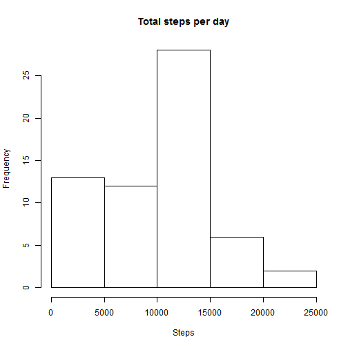
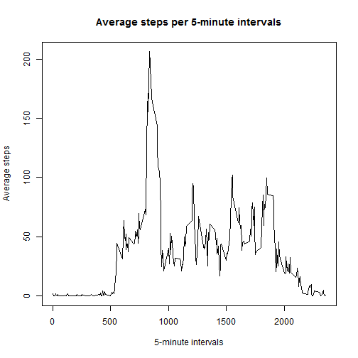

# Reproducible Research: Peer Assessment 1


## Loading and preprocessing the data

```r
activity <- read.table("activity.csv", header = TRUE, sep = ",")
```

## What is mean total number of steps taken per day?
### Histogram of the Total number of steps per day:

```r
hist(tapply(activity$steps, activity$date, sum, na.rm = TRUE), main = "Total steps per day", 
    xlab = "Steps")
```

 

```r
mdn <- median(tapply(activity$steps, activity$date, sum, na.rm = TRUE))
mn <- mean(tapply(activity$steps, activity$date, sum, na.rm = TRUE))
```

### Mean per day: 9354.2295
### Median per day: 10395

## What is the average daily activity pattern?
### Plot of the  5-minute interval / Average number of steps(across all days):

```r
ave_steps <- tapply(activity$steps, activity$interval, mean, na.rm = TRUE)
min_inter <- unique(activity$interval)
plot(min_inter, ave_steps, type = "l", xlab = "5-minute intervals", ylab = "Average steps", 
    main = "Average steps per 5-minute intervals")
```

 

```r
max <- which.max(ave_steps)
min_interval <- min_inter[max]
average_steps_max <- ave_steps[max][[1]]
```

### 5-minute interval with maximun number of steps on average: 835
### Maximun number of steps on average: 206.1698
## Imputing missing values


## Are there differences in activity patterns between weekdays and weekends?
